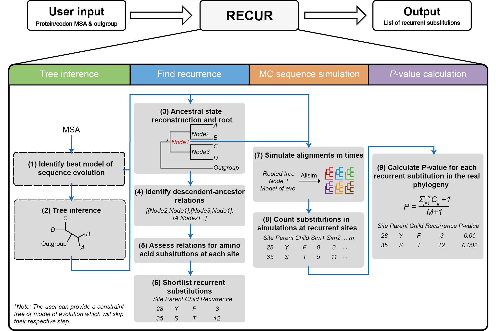
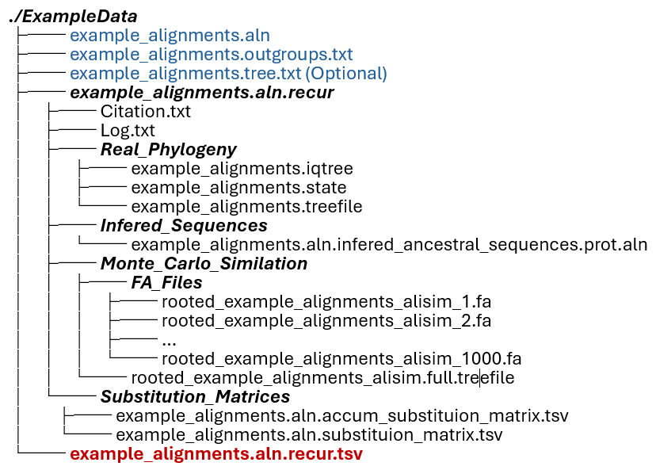

# RECUR
Finding Recurrent Substitutions in Multiple Sequence Alignments

## Introduction


<p style="text-align: center;">Figure 1: The RECUR workflow. </p>

The required input is either a protein or codon multiple sequence alignment (in FASTA format) and a defined outgroup species or clade. The output of RECUR is a list of recurrent amino acid substitutions that have been inferred to have occurred within the phylogeny (file suffix .recfinder.tsv). Outputs of intermediate steps, i.e. model selection, tree inference, ancestral state reconstruction and site substitution matrices, can be found in the .recfinder output directory. 

## Table of Contents

- [Getting started with RECUR](#getting-started-with-recur)
  - [Installing RECUR on Linux](#installing-recur-on-linux)
  - [Installing RECUR on Windows and MacOS](#installing-recur-on-windows-and-macos)
  - [Running RECUR in Conda](#running-recur-in-conda)
  - [Running RECUR in a Docker Conatainer](#running-recur-in-a-docker-conatainer)
- [How to use RECUR](#how-to-use-recur)
  - [Options Overview](#options-overview)
  - [Simple Usage](#simple-usage)
  - [Advance Usage](#advanced-usage)
  - [Output Structure](#output-structure)
  - [Discussion](#discussion)
- [Citations](#citations)
  - [Credits and Acknowledgements](#credits-and-acknowledgements)
- [References](#references)
- [Contributing](#contributing)


## Getting Started with RECUR
The recurrence analysis implemented by RECUR utilises IQ-TREE2 phylogenomic software package to infer the extinct node sequences and to build the simulated phylogeny. 

### Installing RECUR on Linux

  If you are working on a Linux machine or WSL2, runing RECUR is straigtforward. Installation of IQ-TREE2 is not necessary.

  Before installing any relevant dependencies or packages, it is recommended that you create and activate a new virtual environment. You can do so by running:
  ```
  python3 -m venv .venv && . .venv/bin/activate
  ```
  *To deactivate the virtual enviroment* run
  ```
  deactivate
  ```
  1. Clone the repository
  ```
  git clone https://github.com/OrthoFinder/RECUR.git
  ```
  2. Navigate into the cloned repository
  ```
  cd RECUR
  ```
  3. Install the package [Optional]
  ```
  pip install .
  ```
  To test your installation, please run

  ```
  recur -f ExampleData/example_alignments.aln -st AA --outgroups ExampleData/example_alignments.outgroups.txt
  ```
    
  If you do not wish to install the RECUR package, you can simply run the following command to install the required dependencies.

  ```
  pip install -r requirements.txt
  ```
  Then run 
  ```
  python3 recur.py -f ExampleData/example_alignments.aln -st AA --outgroups ExampleData/example_alignments.outgroups.txt
  ```
  to test the installation and the environment. 
  
  > NOTE: if python3 does not work, please try python.

### Installing RECUR on Windows and MacOS 

  If you are on a Windows machine or a MAC, you need to install the IQ-TREE2 first before you can run RECUR. You can download the latest version of IQ-TREE2 in [here](http://www.iqtree.org/#download).

  Once you have IQ-TREE2 installed, you can run the following commands based on your OS to create a virtual environment for RECUR to run.

  - **Windows**

  If you are on windows, please open a command prompt, and run the following commnad to create and activate the virtual environment.
  ```
  python -m venv win_venv
  win_venv\Scripts\activate.bat
  ```

  *To deactivate the virtual enviroment* run
  ```
  win_venv\Scripts\deactivate.bat
  ```
  - **macOS**

  If you are on macOS, please run the following commands in a terminal.

  ```
  python3 -m venv mac_venv
  source mac_venv/bin/activate
  ```

  *To deactivate the virtual enviroment* run
  ```
  deactivate
  ```
  Now that you have successfully created and activated a new virtual environment, you can follow the three steps mentioned in [Installing RECUR on Linux](#installing-recur-on-linux) to install RECUR or just the python dependencies based on your needs. Then run one of the following commands (depending one whether you have installed RECUR or not) to test if RECUR runs on your machine.

  * With RECUR installed 
    ```
    recur -f ExampleData/example_alignments.aln -st AA --outgroups ExampleData/example_alignments.outgroups.txt -iv system
    ```
  * Without RECUR installed 
      ```
    python3 recur.py -f ExampleData/example_alignments.aln -st AA --outgroups ExampleData/example_alignments.outgroups.txt -iv system
    ```
  where `-iv` stands for IQ-TREE2 version. By default, RECUR will use the Linux binary version from the package. 

### Running RECUR in Conda

  Working in the conda environment can be the easiest when you do not have access to a Linux machine. You can create and activate a new environment by running:

    ```
    conda create -n recur_env python=3.12
    conda activate recur_env
    ```
  Then install IQ-TREE2 package by running one of the following:
  ```
    conda install bioconda::iqtree
    conda install bioconda/label/cf201901::iqtree
  ```
  Now that you have a suitable environment with IQ-TREE2 installed, you can follow the previous steps to install RECUR directly or the relevant dependencies.
  * With RECUR installed 
    ```
    recur -f ExampleData/example_alignments.aln -st AA --outgroups ExampleData/example_alignments.outgroups.txt -iv conda
    ```
  * Without RECUR installed 
      ```
    python3 recur.py -f ExampleData/example_alignments.aln -st AA --outgroups ExampleData/example_alignments.outgroups.txt -iv conda
    ```

### Running RECUR in a Docker Conatainer

  Apart from the above methods, you can also run RECUR inside a container. 

  - Personal computer
  
    Before you can run the RECUR container, you need to have Docker Desktop installed. 
    - Windows: https://docs.docker.com/desktop/install/windows-install/
    - macOS: https://docs.docker.com/desktop/install/mac-install/
    - Linux: https://docs.docker.com/desktop/install/linux-install/

    Once you have the Docker Desktop installed, please launch it and run the following command in the terminal to check if it is up and running.

    ```
    docker version
    ```
  - **Server**

    If you need to install the Docker Engine before you can run the RECUR container.

    Please find the right docker engine to install on your server in [here](https://docs.docker.com/engine/install/).

  With either Docker Decktop or Docker Engine installed on your machine, you can simply run the following command to test if you can run the RECUR container
  ```
  docker container run -it --rm orthofinder/recur:v1.0.0
  ```
  To run the RECUR container on your dataset, you will need to create a folder which contains your data in your current working directory. For instance, you have a data folder called MyData which contains an protein alignment file called `my_alignment.aln` and a file called `my_alignment.outgroups.txt` that contains all the ourgroups, you can run the following command to start the RECUR container and make it run your dataset.
  ```
  docker container run -it --rm -v $(pwd)/MyData:/usr/src/RECUR/MyData orthofinder/recur:v1.0.0 recur -f MyData/my_alignment.aln -st AA --outgroups MyData/my_alignment.outgroups.txt   
  ```
  Please note that arguments behind `orthofinder/recur:v1.0.0` will be the same as you run RECUR directly as we mentioned previous sections.

## How to use RECUR

In this section, we will dive deep into the options you can have to run RECUR. The commands shown in this section will be based on the assumption that you have RECUR installed on your machine. 

### Options Overview

```
  -f <dir/file>                FASTA format alignment of protein or corresponding codon alignment [Required]
  -s <str>                     <AA|CODON> [Required][Default: CODON11]
  --outgroups <dir/file/str>   List of outgroup species [Required]
  --num-alignments <int>       Number of simulated alignments for p-value estimation [Default: 1000]
  -te <dir/file>               Complete constraint tree [Default: Estimated from alignment]
  -m <str>                     Model of sequence evolution [Default: estimated from alignment]
  -nt <int>                    Number of threads provided to IQ-TREE2
  -rt <int>                    Number of threads used for RECUR run on IQ-TREE2 
  -t <int>                     Number of threads used for RECUR internal processing 
  --seed <int>                 Random starting see number [Default: 8]
  -o <txt>                     Non-default results directory
  -iv <str>                    IQ-TREE2 path [Default: local]
```


### Simple Usage

The minimal requirements of RECUR is a MSA (protein or codon) in FASTA format with the sequence type specified and a defined outgroup species or clade. e.g., RECUR can run on either a protien or a CODON alignment. 

>`recur [options] -f <alignment_file> --outgroups <outgroup_species/file> -st <AA|CODON>`

* `--outgroups`: informs RECUR how to correctly root the tree. 

   You can either provide a .txt file with each outgroup species listed on a new line, or if you have a few outgroup species you can write the species on the command line. e.g., `--outgroups "SpeciesA,SpeciesB,SpeciesC"`. 

* `-st`: signals the sequence type in the MSA. 

   For a protein MSA `-st AA` should be provided. For a codon MSA, the different NCBI genetic codes can be specified (found [here](http://www.iqtree.org/doc/Substitution-Models#codon-models)). `-st CODON` will use the standard genetic code. 

For example, the example commands mentioned in the [Getting started with RECUR](#getting-started-with-recur) section runs on an example_alignments.aln file which sits inside the ExampleData folder with the outgroups specified in the example_alignments.outgroups.txt file.

### Advanced Usage

- Using a constraint tree 

To specify the topology of the phylogeny used by RECUR the user can provide a constraint tree using the `-te` flag. The argument is a file containing a tree in Newick format. E.g., 

```
recur [options] -f <alignment_file> --outgroups <outgroup_species/file> -st <AA|CODON> -te <treefile> 
```

Furthermore, a model of sequence evolution (as long as it is supported by IQ-TREE2) can be provided using the -m flag. 

Running RECUR on a directory 

recur [options] -f <directory> --outgroups <directory> -st <AA|CODON> 

How do the files need to be named in the directory??? 

Multi-threading 

- Running RECUR on multiple genes

```
recur [options] -f <dir/file> --outgroups <outgroup_species/dir/file> -st <AA|CODON>
```

- Running RECUR with parallel processing


> **important information**:
>  * `<alignment_file>`: can have `.aln`, `fasta`, or `fa` as the file extensions
>  * `<outgroups_file>`: needs to have `.outgroup` in the file name.
>  * `<treefile>`: needs to have `.tree` in the file name.


### Output Structure

<!-- 
 -->
<p align="center">
  
</p>


### Discussion

## Citations

### Credits and Acknowledgements

## References


## Contributing

If you find a bug :bug:, please open a [bug report](https://github.com/).
If you have an idea for an improvement or new feature, please open a [feature request]().
