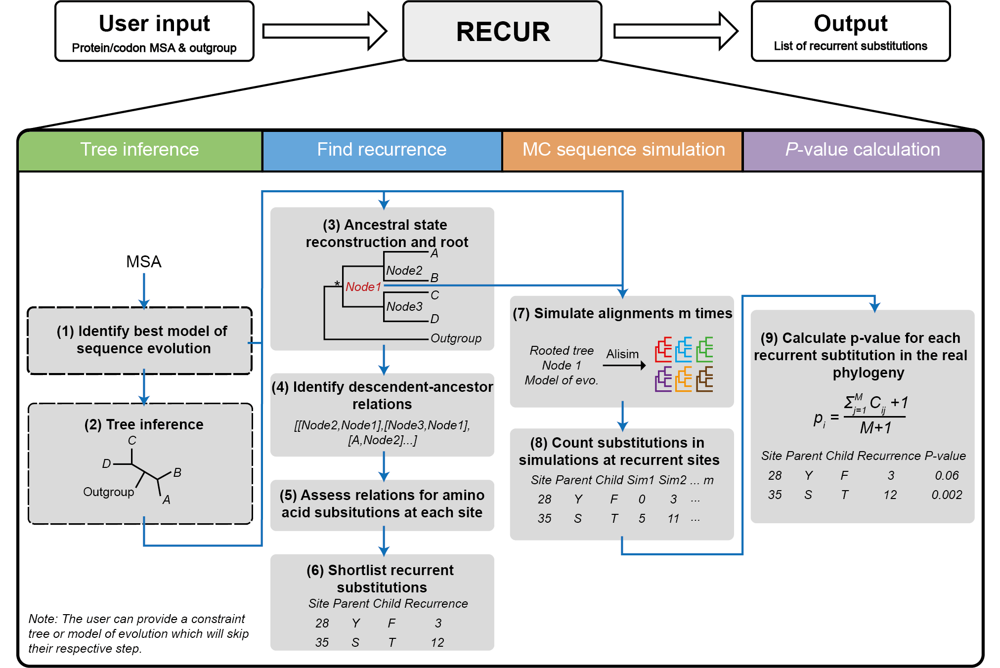
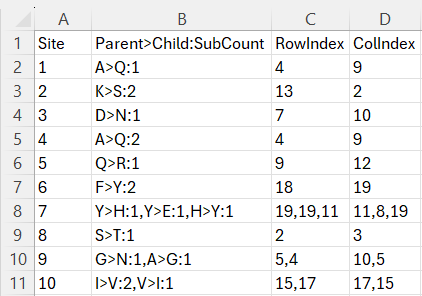
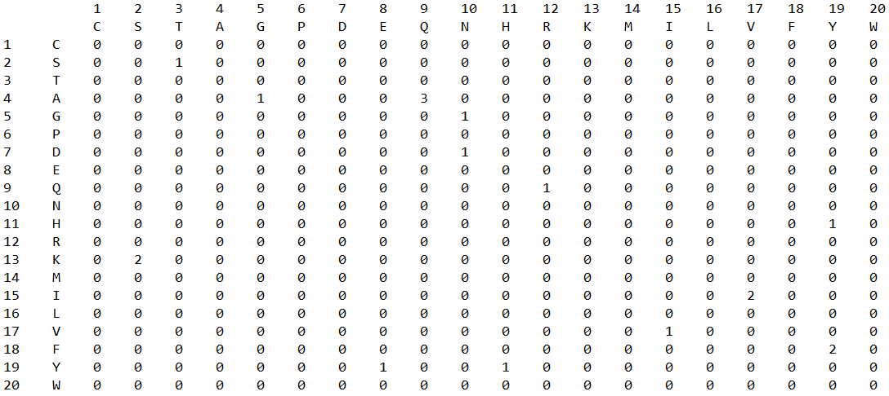
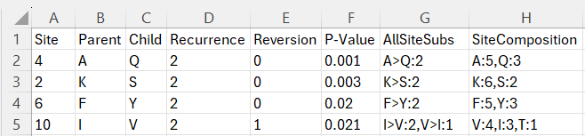

# RECUR 

Finding Recurrent Substitutions in Multiple Sequence Alignments

## Introduction


<p style="text-align: center;">Figure 1: The RECUR workflow. </p>

The required input is either a protein or codon multiple sequence alignment (in FASTA format) and a defined outgroup species or clade. The output of RECUR is a list of recurrent amino acid substitutions that have been inferred to have occurred within the phylogeny (file suffix .recfinder.tsv). Outputs of intermediate steps, i.e. model selection, tree inference, ancestral state reconstruction and site substitution matrices, can be found in the .recfinder output directory. 

## Table of Contents

- [Getting started with RECUR](#getting-started-with-recur)
  - [Installing RECUR on Linux](#installing-recur-on-linux)
  - [Installing RECUR on Windows and MacOS](#installing-recur-on-windows-and-macos)
  - [Running RECUR in Conda](#running-recur-in-conda)
  - [Running RECUR in a Docker Conatainer](#running-recur-in-a-docker-conatainer)
- [How to Use RECUR](#how-to-use-recur)
  - [Options Overview](#options-overview)
  - [Simple Usage](#simple-usage)
  - [Advance Usage](#advanced-usage)
  - [Output Structure](#output-structure)
  - [Interpretation of the Recurrence List](#interpretation-of-the-recurrence-list)
  - [Discussion](#discussion)
- [Citations](#citations)
  - [Credits and Acknowledgements](#credits-and-acknowledgements)
- [References](#references)
- [Contributing](#contributing)


## Getting Started with RECUR
The recurrence analysis implemented by RECUR utilises IQ-TREE2 phylogenomic software package to infer the extinct node sequences and to build the simulated phylogeny. 

### Installing RECUR on Linux

  If you are working on a Linux machine or WSL2, runing RECUR is straigtforward. Installation of IQ-TREE2 is not necessary.

  Before installing any relevant dependencies or packages, it is recommended that you create and activate a new virtual environment. You can do so by running:
  ```
  python3 -m venv .venv && . .venv/bin/activate
  ```
  *To deactivate the virtual enviroment* run
  ```
  deactivate
  ```
  1. Clone the repository
  ```
  git clone https://github.com/OrthoFinder/RECUR.git
  ```
  2. Navigate into the cloned repository
  ```
  cd RECUR
  ```
  Once you are inside the package's root directory, based on your requirments, you can choose either to install RECUR on your machine or just the required public python dependencies.
  * Option 1:  Install RECUR

    Running the following command will help you install RECUR in your current virtual environment.
    ```
    pip install .
    ```
    To test your installation, please run
    ```
    recur -f ExampleData/example_alignments.aln -st AA --outgroups ExampleData/example_alignments.outgroups.txt
    ```
  * Option 2: Install the requirements.txt without installing the package

    If you do not wish to install the RECUR package, you can simply run the following command to install the required dependencies.
    ```
    pip install -r requirements.txt
    ```
    Then run 
    ```
    python3 recur.py -f ExampleData/example_alignments.aln -st AA --outgroups ExampleData/example_alignments.outgroups.txt
    ```
  to test the installation and the environment. 
  
  > NOTE: if python3 does not work, please try python.

### Installing RECUR on Windows and MacOS 

  If you are on a Windows machine or a MAC, you need to install the IQ-TREE2 first before you can run RECUR. You can download the latest version of IQ-TREE2 in [here](http://www.iqtree.org/#download).

  Once you have IQ-TREE2 installed, you can run the following commands based on your OS to create a virtual environment for RECUR to run.

  - **Windows**

  If you are on windows, please open a command prompt, and run the following commnad to create and activate the virtual environment.
  ```
  python -m venv win_venv
  win_venv\Scripts\activate.bat
  ```

  *To deactivate the virtual enviroment* run
  ```
  win_venv\Scripts\deactivate.bat
  ```
  - **macOS**

  If you are on macOS, please run the following commands in a terminal.

  ```
  python3 -m venv mac_venv
  source mac_venv/bin/activate
  ```

  *To deactivate the virtual enviroment* run
  ```
  deactivate
  ```
  Now that you have successfully created and activated a new virtual environment, you can follow the three steps mentioned in [Installing RECUR on Linux](#installing-recur-on-linux) to install RECUR or just the python dependencies based on your needs. Then run one of the following commands (depending one whether you have installed RECUR or not) to test if RECUR runs on your machine.

  * With RECUR installed 
    ```
    recur -f ExampleData/example_alignments.aln -st AA --outgroups ExampleData/example_alignments.outgroups.txt -iv system
    ```
  * Without RECUR installed 
      ```
    python3 recur.py -f ExampleData/example_alignments.aln -st AA --outgroups ExampleData/example_alignments.outgroups.txt -iv system
    ```
  where `-iv` stands for IQ-TREE2 version. By default, RECUR will use the Linux binary version from the package. 

### Running RECUR in Conda

  Working in the conda environment can be the easiest when you do not have access to a Linux machine. You can create and activate a new environment by running:

    ```
    conda create -n recur_env python=3.12
    conda activate recur_env
    ```
  Then install IQ-TREE2 package by running one of the following:
  ```
    conda install bioconda::iqtree
    conda install bioconda/label/cf201901::iqtree
  ```
  Now that you have a suitable environment with IQ-TREE2 installed, you can follow the previous steps to install RECUR directly or the relevant dependencies.
  * With RECUR installed 
    ```
    recur -f ExampleData/example_alignments.aln -st AA --outgroups ExampleData/example_alignments.outgroups.txt -iv conda
    ```
  * Without RECUR installed 
      ```
    python3 recur.py -f ExampleData/example_alignments.aln -st AA --outgroups ExampleData/example_alignments.outgroups.txt -iv conda
    ```

### Running RECUR in a Docker Conatainer

  Apart from the above methods, you can also run RECUR inside a container. You can find the RECUR image on [Docker Hub](https://hub.docker.com/repository/docker/orthofinder/recur/general).

  - **Personal computer**
  
    Before you can run the RECUR container, you need to have Docker Desktop installed. 
    - Windows: https://docs/images.docker.com/desktop/install/windows-install/
    - macOS: https://docs/images.docker.com/desktop/install/mac-install/
    - Linux: https://docs/images.docker.com/desktop/install/linux-install/

    Once you have the Docker Desktop installed, please launch it and run the following command in the terminal to check if it is up and running.

    ```
    docker version
    ```
  - **Server**

    If you need to install the Docker Engine before you can run the RECUR container.

    Please find the right docker engine to install on your server in [here](https://docs/images.docker.com/engine/install/).

  With either Docker Decktop or Docker Engine installed on your machine, you can simply run the following command to test if you can run the RECUR container
  ```
  docker container run -it --rm orthofinder/recur:v1.0.0
  ```
  To run the RECUR container on your dataset, you will need to create a folder which contains your data in your current working directory. For instance, you have a data folder called MyData which contains an protein alignment file called `my_alignment.aln` and a file called `my_alignment.outgroups.txt` that contains all the ourgroups, you can run the following command to start the RECUR container and make it run your dataset.
  ```
  docker container run -it --rm -v $(pwd)/MyData:/usr/src/RECUR/MyData orthofinder/recur:v1.0.0 recur -f MyData/my_alignment.aln -st AA --outgroups MyData/my_alignment.outgroups.txt   
  ```
  Please note that arguments behind `orthofinder/recur:v1.0.0` will be the same as you run RECUR directly as we mentioned previous sections. 

## How to Use RECUR

In this section, we will dive deep into the options you can have to run RECUR. The commands shown in this section will be based on the assumption that you have RECUR installed on your machine. 

### Options Overview

```
  -f <dir/file>                FASTA format alignment of protein or corresponding codon alignment [Required]
  -s <str>                     <AA|CODON> [Required][Default: CODON11]
  --outgroups <dir/file/str>   List of outgroup species [Required]
  --num-alignments <int>       Number of simulated alignments for p-value estimation [Default: 1000]
  -te <dir/file>               Complete constraint tree [Default: Estimated from alignment]
  -m <str>                     Model of sequence evolution [Default: estimated from alignment]
  -nt <int>                    Number of threads provided to IQ-TREE2
  -rt <int>                    Number of threads used for RECUR run on IQ-TREE2 
  -t <int>                     Number of threads used for RECUR internal processing 
  --seed <int>                 Random starting see number [Default: 8]
  -o <txt>                     Non-default results directory
  -iv <str>                    IQ-TREE2 path [Default: local]
```

Please note that the default values for `-nt`, `-rt`, `-t` are processor dependent. If you are following the installation step mentioned in the previous section, you can run one of the following commands to find out the actaul default setting for your machine.

```
recur 
python3 recur.py
```

### Simple Usage

The minimal requirements of RECUR is a MSA (protein or codon) in FASTA format with the sequence type specified and a defined outgroup species or clade. e.g., RECUR can run on either a protien or a CODON alignment. 

>`recur [options] -f <alignment_file> --outgroups <outgroup_species/file> -st <AA|CODON>`

* `--outgroups`: informs RECUR how to correctly root the tree. 

   You can either provide a .txt file with each outgroup species listed on a new line, or if you have a few outgroup species you can write the species on the command line. e.g., `--outgroups "SpeciesA,SpeciesB,SpeciesC"`. 

* `-st`: signals the sequence type in the MSA. 

   For a protein MSA `-st AA` should be provided. For a codon MSA, the different NCBI genetic codes can be specified (found [here](http://www.iqtree.org/doc/Substitution-Models#codon-models)). `-st CODON` will use the standard genetic code. 

For example, the example commands mentioned in the [Getting started with RECUR](#getting-started-with-recur) section runs on an example_alignments.aln file which sits inside the ExampleData folder with the outgroups specified in the example_alignments.outgroups.txt file.

> **important information**:
>  * `<alignment_file>`: can have `.aln`, `fasta`, or `fa` as the file extensions
>  * `<outgroups_file>`: needs to have `.outgroup` in the file name.
>  * `<treefile>`: needs to have `.tree` in the file name.

### Advanced Usage

- Using a constraint tree 

To specify the topology of the phylogeny used by RECUR the user can provide a constraint tree using the `-te` flag. The argument is a file containing a tree in Newick format. E.g., 

```
recur [options] -f <alignment_file> --outgroups <outgroup_species/file> -st <AA|CODON> -te <treefile>
```

- Providing a model of evolution

A model of sequence evolution (as long as it is supported by IQ-TREE2) can be provided using the `-m` flag. E.g.,

```
recur [options] -f <alignment_file> --outgroups <outgroup_species/file> -st <AA|CODON> -te <treefile> -m <model_of_evolution>
```

- Running RECUR on a directory 

To free you from typing multiple commands in a terminal to run on multiple genes, RECUR provides an option to run on a folder. E.g., 

```
recur [options] -f <directory> --outgroups <directory> -st <AA|CODON> -te <directory>
````
For example, if you have three genes files, each have a different set of outgroups and treefiles. You can place those outgroups files and tree files with the corresponding gene names inside the same MSA data folder. E.g.,
<p align="center">
  
</p>

If your genes share the same outgroups and tree, you only need to create a single outgroups file and tree file in your data folder. Those two files will be share by all the genes for your RECUR analysis. E.g., 

<p align="center">
  
</p>

- Running RECUR with parallel processing

To speed up the analysing process, RECUR has introduced both multiprocessing and multithreading in the package. You can use the following three options to manage your resources and maximise the speed.

- `-rt`: Number of threads runs on the IQ-TREE2 commands
- `-nt`: Number of threads for IQ-TREE2 to run in parallel (**[only for the SH-aLRT test](http://iqtree.org/doc/Command-Reference#tree-search-for-pathogen-datae)**)
- `t`: Number of threads used for the RECUR algorithms

By default, all three values will be automatically defined based the configureation of your machine. Neither of them, if defined by a user,  cannot exceed the computer allownce, which is defined by the specific architecture of the CPU, namely, 

> * `-t` <= maximum_num_logical_threads
> * `-rt` <= maximum_num_logical_threads
> * `-nt` <= maximum_num_logical_threads
> * `-rt` * `-nt` <= maximum_num_logical_threads

For instance, if your computer has 8 lolgic threads, you can have the following setup,

```
recur -f example_alignments.aln -st AA --outgroups example_alignments.outgroups.txt -t 8 -rt 1 -nt 8
```
or 

```
recur -f example_alignments.aln -st AA --outgroups example_alignments.outgroups.txt -t 8 -rt 2 -nt 4
```

### Output Structure

<p align="center">
  
</p>

Every time when you run RECUR, it will output a folder which contains some subfolders with intermediate results and a `.tsv` file which contains the final recurrence list of your data. 

If you do not specify the output folder using `-o`, after successfully running RECUR, you can find the recurrence list inside the same data folder where you have your MSA alignment files. 

For example, after you have run RECUR on the alignment file inside the ExampleData, you will obtain a folder which has the same name of your input alignment file with a trailing `.recur`. In this case, it is `example_alignments.aln.recur`. 

Inside the `example_alignments.aln.recur` folder, you will find two `.txt` files, i.e., `Citation.txt` and `Log.txt`, and four subdirectories, i.e., `Real_Phylogeny`, `Infered_Sequences`, `Monte_Carlo_Simulation` and `Substitution_Matirces`. 

- `Real_Phylogeny`: contains the necessary IQ-TREE2 output files, i.e., `*.iqtree`, `*.state` and `*.treefile`,  to reconstruct the ancestral sequences.
- `Infered_Sequences`: contains the infered ancestral sequences alignemnt files. Depending on the input sequence type, you can either find one protein alignment file or one codon alignment file and a protein alignment file. Since the `example_alignments.aln` contains the protein sequences, you can only see one infered ancestral sequence inside this folder.
- `Substitution_Matirces`: contains a `*.substituion_matrix.tsv` file and a `*.accum_substituion_matrix.txt` file. The `*.substituion_matrix.tsv` summarises the substitution happened between the parent sequence and the child sequence at each residue for the infered real phylogeny, while the `*.accum_substituion_matrix.txt` presents the accumulated subsititution for all residues of the infered real phylogeny. 

For example, by running RECUR on the `example_alignments.aln` file, the `example_alignments.aln.substituion_matrix.tsv` would have the following content
<p align="center">
  
</p>

The `Site` is ordered in an continuous accending order. If subsitution was found between the parent and child sequence, the letter representation of the parent residue and the child as well as the mutation count was presented in the `Parent>Child:MutCount` column, 
`-` is used to indicate that there is no subsitution was found.

<p align="center">
  
</p>

- `Monte_Carlo_Simulation`: 


### Interpretation of the Recurrence List

<p align="center">
  
</p>

### Discussion

According to Shen et al. (2020), irreproducibility in maximum likelihood phylogenetic inference is a significant issue [^1]. Regardless of the method related parameters that would affect the reprocibility of the final outputs, different random starting seed number, number of threads and processor type can also introduce uncertainties to the results. Such effect can be observed by setting different combination of `-rt` and `-nt`, or setting different seed number using `--seed` in RECUR for each run. When running RECUR on different machine with different processor type even with the fixed `-rt`, `-nt` and `--seed`, the results can still be different. Nevertheless, the results should stay the same for each run when running RECUR on the same machine with the fixed input parameters.  


## Citations

### Credits and Acknowledgements

## Contributing

If you find a bug :bug:, please open a [bug report](https://github.com/).
If you have an idea for an improvement or new feature, please open a [feature request]().

## References
[^1]: *Shen, XX., Li, Y., Hittinger, C.T. et al.* **An investigation of irreproducibility in maximum likelihood phylogenetic inference.** Nat Commun 11, 6096 (2020). [](https://doi.org/10.1038/s41467-020-20005-6)

