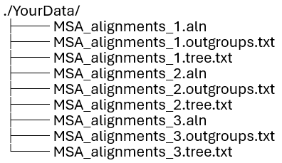
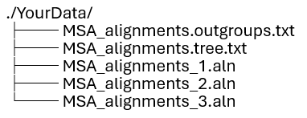
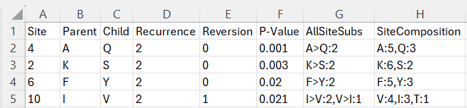
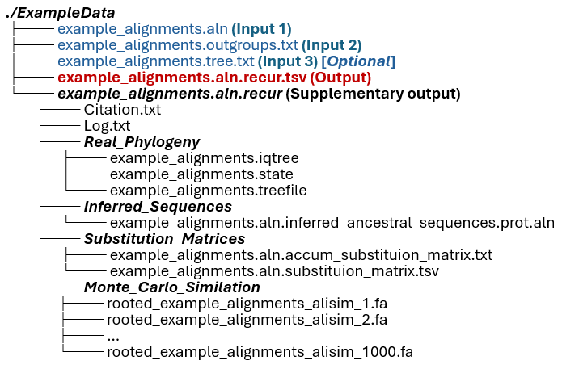
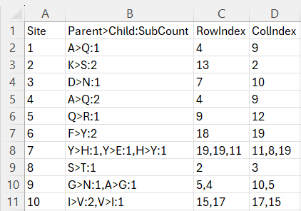
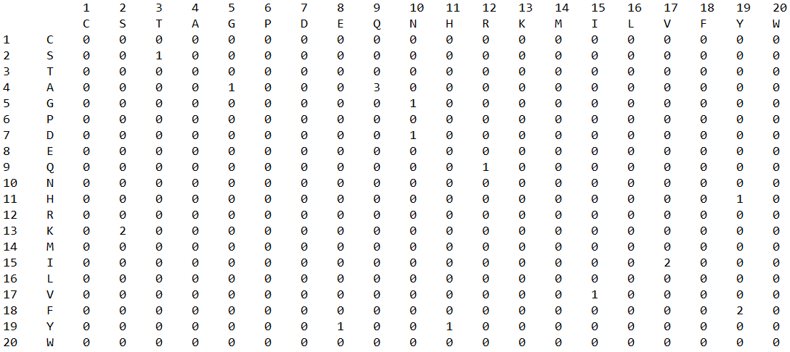

## How to Use RECUR

- [Simple Usage](#simple-usage)
- [Advance Usage](#advanced-usage)
  - [Options Overview](#options-overview)
  - [Using a constraint tree](#using-a-constraint-tree)
  - [Providing a model of evolution](#providing-a-model-of-evolution)
  - [P-value adjustment](#p-value-adjustment)
  - [Multi-stage computation](#multi-stage-computation)
  - [Running RECUR on a directory](#running-recur-on-a-directory)
- [RECUR Results](#recur-results)
  - [Recurrence List](#recurrence-list)
  - [Output Structure and Extended Results](#output-structure-and-exteneded-results)
- [A Note on Reproducibility](#a-note-on-reproducibility)
- [References](#references)

## **Simple Usage**

The minimal requirements of RECUR is a MSA (protein or codon) in FASTA format with the sequence type specified and a defined outgroup species or clade. e.g.,

`recur [options] -f <alignment_file> --outgroups <outgroup_species/file> -st <AA|CODON>`

* `--outgroups`: informs RECUR how to correctly root the tree.

   You can either provide a .txt file with each outgroup species listed on a new line, or if you have a small number of outgroup species you can write the species on the command line. e.g., `--outgroups "SpeciesA,SpeciesB,SpeciesC"`.

* `-st`: signals the sequence type in the MSA.

   For a protein MSA `-st AA` should be provided. For a codon MSA, the different NCBI genetic codes can be specified (defined [here](http://www.iqtree.org/doc/Substitution-Models#codon-models)). `-st CODON` will use the standard genetic code.


<!-- ### Options Overview -->

## **Advanced Usage**

### **1. Options Overview**

In this section, we will dive deep into the options you have to run RECUR. The commands shown in this section will assume that you have RECUR installed on your machine.

+ ***Required Arguments***

<table>
  <thead>
    <tr>
      <th style="width: 350px;">Option</th>
      <th>Description</th>
    </tr>
  </thead>

  <tbody>

    <tr>
      <td><code>-f &lt;dir/file&gt;</code></td>
      <td>
        <b>Protein or codon alignment</b> in FASTA format.
      </td>
    </tr>

    <tr>
      <td><code>-st &lt;str&gt;</code></td>
      <td>
        Sequence type: <code>AA</code> or <code>CODON</code>.
        Default: <code>AA</code>.
        <br><br>

        If no codon number is specified,
        <code>CODON1</code> is used.

        To specify genetic codes, append a number
        (e.g. <code>CODON2</code>).

        Valid options include:
        <code>CODON1–CODON11</code>.

        See:
        <a href="http://www.iqtree.org/doc/Substitution-Models#codon-models">
        IQ-TREE codon models
        </a>.
      </td>
    </tr>

    <tr>
      <td><code>--outgroups &lt;dir/file/str&gt;</code></td>
      <td>
        List of <b>outgroup sequence names</b>.
      </td>
    </tr>

  </tbody>
</table>

---

+ ***Simulation and Statistical Settings***

<table>
  <thead>
    <tr>
      <th style="width: 350px;">Option</th>
      <th>Description</th>
    </tr>
  </thead>

  <tbody>

    <tr>
      <td><code>--num-alignments &lt;int&gt;</code></td>
      <td>
        Number of simulated alignments used for
        p-value estimation.

        Default:
        automatically determined to detect
        sufficiently small p-values.
      </td>
    </tr>

    <tr>
      <td><code>-sl &lt;float&gt;</code></td>
      <td>
        Significance level.

        Default:
        <code>0.05</code>.
      </td>
    </tr>

    <tr>
      <td><code>-pam &lt;str&gt;</code></td>
      <td>
        P-value adjustment method.

        Available methods:
        <code>bonferroni</code>,
        <code>holm</code>,
        <code>fdr_bh</code>,
        <code>fdr_by</code>,
        <code>fdr_tsbh</code>,
        <code>fdr_tsbky</code>.

        Default:
        automatically selected based on
        <code>--num-alignments</code>.
      </td>
    </tr>

    <tr>
      <td><code>-bs &lt;int&gt;</code></td>
      <td>
        Batch size for Monte Carlo simulations
        (reduces RAM usage).

        Default:
        disabled.
      </td>
    </tr>

  </tbody>
</table>

---

+ ***Tree and Model Options***

| Option | Description |
|-------|-------------|
| `-te <dir/file>` | Provide a **constraint tree**. Default: tree estimated from alignment. |
| `-m <str>` | Model of sequence evolution. Default: automatically selected from alignment. |
| `-blfix` | Fix branch lengths of the constraint tree. Default: disabled. |
| `--no-branch-test` | Disable branch support testing. Default: enabled. |

---

+ ***Performance and Runtime Options***

| Option | Description |
|-------|-------------|
| `-t <int>` | Number of threads used for **RECUR internal processing**. Default: `24`. |
| `-nt <int>` | Number of threads provided to **IQ-TREE**. Default: `1` (without ALRT), `6` (with ALRT). |
| `--seed <int>` | Random seed number. Default: `8`. |
| `--iqtree-version <str>` | IQ-TREE executable name or version. Default: `iqtree3`. |


Please note that the default values for `-t`, `-nt` are processor dependent. If you are following the installation step mentioned in the previous section, you can run one of the following commands to find out the actual default setting for your machine.

```bash
recur
python3 recur.py
```

---

+ ***Output and Logging***

| Option | Description |
|-------|-------------|
| `--output <txt>` | Output directory. Default: same directory as the input alignment. |
| `-uc <int>` | Update cycle for progress bar display. Default: disabled. |

---

+ ***Help***

| Option | Description |
|-------|-------------|
| `--help-verbose` | Display full help with all available options. |

---


If you run RECUR with `--help-verbose`, additional configuration options and detailed explanations will be shown:

+ ***Advanced and Restart Options***

<table>
  <thead>
    <tr>
      <th style="width: 280px;">Option</th>
      <th>Description</th>
    </tr>
  </thead>

  <tbody>

    <tr>
      <td><code>-rs &lt;int&gt;</code></td>
      <td>
        <b>Restart RECUR at a specified step.</b>
        Default: <code>1</code>.
        <br><br>

        <b>Without phylogenetic tree provided:</b>
        <ol>
          <li>Infer phylogenetic tree and model of evolution</li>
          <li>Infer ancestral sequences</li>
          <li>Simulate sequence evolution</li>
          <li>Analyse recurrent substitutions</li>
        </ol>

        <b>With phylogenetic tree provided:</b>
        <ol>
          <li>Infer evolutionary parameters using the provided tree</li>
          <li>Simulate sequence evolution</li>
          <li>Analyse recurrent substitutions</li>
        </ol>

      </td>
    </tr>

    <tr>
      <td><code>--recur-limit &lt;int&gt;</code></td>
      <td>
        Threshold for retaining simulated alignment files.
        If the number of simulations exceeds this threshold,
        simulated alignment files are deleted to conserve disk space.
        Default: <code>1000</code>.
      </td>
    </tr>

    <tr>
      <td><code>-nb &lt;int&gt;</code></td>
      <td>
        Batch size for Monte Carlo simulations,
        controlling the number of stages in multi-stage analysis.
        Default: disabled.
      </td>
    </tr>

    <tr>
      <td><code>-iv &lt;str&gt;</code></td>
      <td>
        IQ-TREE executable name or version.
        Default: <code>iqtree3</code>.
      </td>
    </tr>

    <tr>
      <td><code>--just-recurrence</code></td>
      <td>
        Return only the recurrence list for the real phylogeny.
        <b>No Monte Carlo simulations are performed.</b>
        Default: disabled.
      </td>
    </tr>

  </tbody>
</table>
--- 


### **2. Using a constraint tree**

To specify the topology of the phylogeny used by RECUR the user can provide a constraint tree using the -te flag. The argument is a file containing a tree in Newick format. E.g.,

```bash
recur [options] -f <alignment_file> --outgroups <outgroup_species/file> -st <AA|CODON> -te <treefile>
```

### **3. Providing a model of evolution**

A model of sequence evolution (as long as it is supported by IQ-TREE) can be provided using the `-m` flag. E.g.,

```bash
recur [options] -f <alignment_file> --outgroups <outgroup_species/file> -st <AA|CODON> -te <treefile> -m <model_of_evolution>
```

### **4. P-value adjustment**
To address p-value inflation arising from multiple hypothesis testing, p-value adjustment was introduced in v1.1.0. The required number of Monte Carlo simulations is automatically determined based on the number of hypothesis tests, denoted by 𝑀 (i.e., the length of the recurrent list). By default, the p-value adjustment method is automatically selected according to 𝑀, balancing statistical rigor and computational feasibility:

```bash
  if M ≤ 50:
      Use Bonferroni correction
      (Strong FWER control; avoids false positives at all costs)

  elif M ≤ 200:
      Use Holm correction
      (Strong FWER control with improved power over Bonferroni)

  elif M ≤ 2000:
      Use Benjamini–Hochberg (BH)
      (Controls the false discovery rate; suitable for large-scale testing)

  else:
      Use two-stage Benjamini–Hochberg (fdr_tsbh)
      (Assumes most hypotheses are null; maximizes power while controlling FDR)

```
This strategy avoids overly conservative corrections when the number of tests is large, thereby preventing an excessive increase in the required number of Monte Carlo simulations, while still providing appropriate error-rate control.

The p-value adjustment is performed using a default significance level of 0.05.
Both the significance level and the p-value adjustment method can be overridden by the user via the command-line flags `-sl` (significance level) and `-pam` (p-value adjustment method), respectively.

### **5. Multi-stage computation**
The introduction of multi-stage computation in RECUR v1.1.0 is a necessary upgrade to support p-value adjustment procedures that may require an excessively large number of Monte Carlo simulations. As the size of the input alignments increases, the disk space required to store simulated alignments can grow rapidly, potentially leading to prohibitive storage demands.

To mitigate this issue, RECUR automatically enables multi-stage execution when the required number of Monte Carlo simulations exceeds an internal threshold (the RECUR limit). By default, this limit is set to 1000 simulations. For example, if 8800 Monte Carlo simulations are required, RECUR will split the computation into 9 batches, corresponding to 9 calls to iqtree alisim. In this case, the first 8 calls use `--num-alignments` 1000, and the final call uses `--num-alignments` 800.

This batching strategy prevents excessive disk usage while ensuring that the total number of simulations is satisfied.

When multi-stage execution is triggered, users may control the batch size by specifying the `-nb` option, which determines the value passed to --num-alignments in each iqtree alisim call. For instance, if `-nb` is set to 2000, then 8800 simulations will be executed in 5 batches instead of 9.

When multi-stage computation is enabled, simulated alignment files are automatically converted into count files to further reduce disk usage. If the required number of Monte Carlo simulations does not exceed the RECUR limit, alignment files are preserved as usual.

If retaining all simulated alignment files is necessary, users may increase the internal threshold using the `--recur-limit` option. By setting this limit higher than the required number of simulations, RECUR will execute the simulations in a single stage and preserve all alignment files.

### **6. Running RECUR on a directory**

To free you from typing multiple commands in a terminal to run on multiple genes, RECUR provides an option to run on a folder. E.g.,

```bash
recur [options] -f <directory> --outgroups <directory> -st <AA|CODON> -te <directory>
```
For example, if you have three genes files, each have a different set of outgroups and tree files. You can place those outgroups files and tree files with the corresponding gene names inside the same MSA data folder. E.g.,
<p align="center">
  
</p>

If your genes share the same outgroups and tree, you only need to create a single outgroups file and tree file in your data folder. Those two files will be share by all the genes for your RECUR analysis. E.g.,

<p align="center">
  
</p>

> **Important Information when running RECUR on a directory**:
>  * `<alignment_file>`: can only have `.aln`, `fasta`, `faa`, or `fa` as the file extensions. (When running RECUR directly on an alignment file, extension requirement does not apply.)
>  * `<outgroups_file>`: needs to have `.outgroup` in the file name.
>  * `<treefile>`: needs to have `.tree` in the file name.

- Running RECUR with parallel processing

To speed up the analysis, RECUR has introduced both multiprocessing and multithreading in the package. By default, the number of threads will be automatically calculated based the configuration of your machine. Alternatively, they can be user specified using the following three options.

- `-t`: Number of threads used for the RECUR algorithms
- `-nt`: Number of threads for IQ-TREE to run in parallel

Note, the number of threads cannot exceed the computer allowance.

> * `-t` <= maximum_num_logical_threads
> * `-nt` <= maximum_num_logical_threads

For instance, if your computer has 8 logical threads, you can have the following setup,

```bash
recur -f example_alignments.aln -st AA --outgroups example_alignments.outgroups.txt -t 8 -nt 8
```

## **RECUR Results**
#### Recurrence List

The main output file from RECUR is a list of all recurrent substitutions inferred to have occurred across the phylogeny, which is found in the `*.recur.tsv` file.

<p align="center">
  
</p>

The `*.recur.tsv` file contains a list of recurrent substitutions, i.e., an amino acid substitution that occurred more than once at a specific site, identified in the alignment. Here is the breakdown of each columns inside this output file:
* `Site`: indicates the position in the protein MSA.
* `Parent`: indicates the ancestral amino acid residue.
* `Child`: indicates the descent amino acid residue.
* `Recurrence`: indicates the number of times that amino acid substitution occurred at that site across the phylogeny.
* `Reversion`: indicates the number of times the reverse amino acid substitution occurred at that site across the phylogeny.
* `P-value`: signifies the probability that the substitution has not occurred by chance (for details of its calculation please read Robbins et al., 2025).

  Note: A p-value equal to 0.001 (with the default 1000 simulations) indicates the recurrence of the substitution was not observed in any of the simulated alignments and is unlikely to have occurred by chance.
* `AllSiteSubs`: provides a list of all other substitutions that occurred at that site.
* `SiteComposition`: indicates the count of each residue at that site in the protein MSA.


#### Output Structure and Extended Results

RECUR outputs additional results files from each step in the analysis which can be found in the `.recur` folder. Provided no output folder was specified using `-o`, the results are structured as seen below. 
<!-- If you do not specify the output folder using `-o`, the results are located in the same directory as the MSA files. -->

<p align="center">
  
</p>

 <!-- Additional results of intermediate steps can be found in the `.recur` folder. -->

Inside the `*.recur` folder, you will find two `*.txt` files, i.e., `Citation.txt` and `Log.txt`, and four subdirectories, i.e., `Real_Phylogeny`, `Infered_Sequences`, `Monte_Carlo_Simulation` and `Substitution_Matirces`.

- `Real_Phylogeny`: contains the tree constructed from the alignment (`*.treefile`), the associated .iqtree file (`*.iqtree`) with information on model testing and the raw ancestral state reconstruction file (`*.state`) output from IQ-TREE.
- `Inferred_Sequences`: contains the inferred ancestral sequences with node labels corresponding to the tree in the Real_Phylogeny directory.
- `Substitution_Matirces`: contains a `*.substituion_matrix.tsv` file and a `*.accum_substituion_matrix.txt` file. The `*.substituion_matrix.tsv` summarises the substitutions that occurred at each site in the protein across the phylogeny, while the `*.accum_substituion_matrix.txt` presents the accumulated counts for each amino acid substitution type across all residues.

For example, by running RECUR on the `example_alignments.aln` file, the `example_alignments.aln.substituion_matrix.tsv` would have the following content:
<p align="center">
  
</p>

`Site` represents the position in the protein alignment. Please note that the sites of an alignment **start from 1** in RECUR. The `Parent>Child:MutCount` column contains a list of amino acid substitutions that occurred at that site. For example, at site 2 a lysine (K) mutated to a serine (S) twice. A dash signifies no substitution was inferred at that site.

As for the `RowIndex` and `ColIndex` columns, they index the substitution in a mutation matrix.  The arrangement of the mutation matrix is the same as that in the accumulated subsititon matrix. Here, the accumulated subsititon matrix is obtained by summing up all the mutation matrix at each site.

<p align="center">
  
</p>

- `Monte_Carlo_Simulation`: contains the simulated alignments based on the best model of evolution,  phylogeny and root sequence of the subtree excluding the outgroup. The number of alignment files in this directory will match the number of Monte Carlo Simulation used in your analysis. It can be adjusted by setting `--num-alignments` to a different value.

## **A Note on Reproducibility**

According to Shen et al. (2020), irreproducibility in maximum likelihood phylogenetic inference is a significant issue [^1]. Regardless of the method related parameters that would affect the reproducibility of the final outputs, different random starting seed number, number of threads and processor type can also introduce uncertainties to the results. Such effect can be observed by setting different `-nt`, or setting different seed number using `--seed` in RECUR for each run. When running RECUR on different machine with different processor type even with the fixed `-nt` and `--seed`, the results can still be different. Nevertheless, the results should stay the same for each run when running RECUR on the same machine with the fixed input parameters.

## **References**

[^1]: *Shen, XX., Li, Y., Hittinger, C.T. et al.* **An investigation of irreproducibility in maximum likelihood phylogenetic inference.** Nat Commun 11, 6096 (2020). [](https://doi.org/10.1038/s41467-020-20005-6)