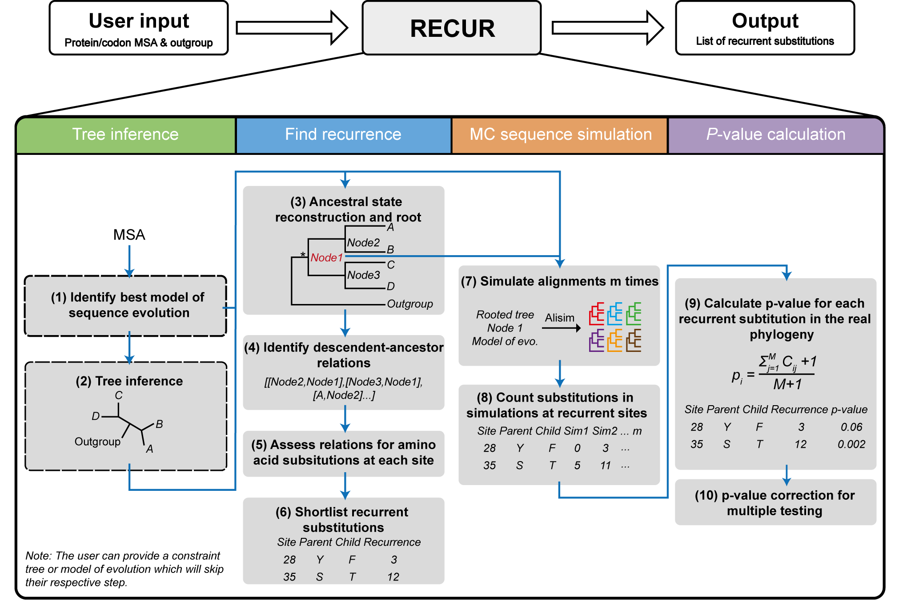

---
# Feel free to add content and custom Front Matter to this file.
# To modify the layout, see https://jekyllrb.com/docs/themes/#overriding-theme-defaults

layout: home
title: Home
---

## Home

### RECUR: Identifying recurrent amino acid substitutions from multiple sequence alignments
 

  Figure 1: The RECUR workflow

The required input is either a protein or codon multiple sequence alignment (in FASTA format) and a defined outgroup species or clade. The output of RECUR is a list of recurrent amino acid substitutions (file suffix: `.recur.tsv`), that have occurred in the inferred phylogeny. Outputs of intermediate steps, i.e. model selection, tree inference, ancestral state reconstruction and site substitution matrices, can be found in the .recur output directory.

## How to Cite?

To cite RECUR, please cite both the following:

[1] *Elizabeth H J Robbins, Yi Liu, Steven Kelly*, **RECUR: identifying recurrent amino acid substitutions from multiple sequence alignments**, *Molecular Biology and Evolution*, Volume 43, Issue 2, February 2026, msag036  

[2] *Minh BQ, Schmidt HA, Chernomor O, Schrempf D, Woodhams MD, von Haeseler A, Lanfear R.* 2020. **IQ-TREE 2: New Models and Efficient Methods for Phylogenetic Inference in the Genomic Era.** Molecular Biology and Evolution 37:1530-1534. 

  If you want to cite an exemplar of RECUR’s usage, please cite:

[3] *Robbins EHJ, Kelly S.* 2024. **Widespread adaptive evolution in angiosperm photosystems provides insight into the evolution of photosystem II repair.** The Plant Cell 37. 

